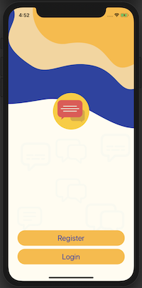
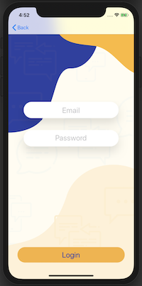
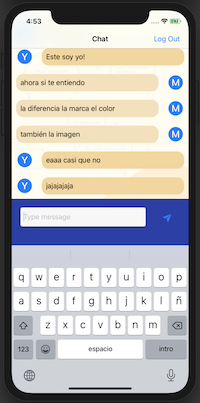

# Chat
A iOS APP Native to chat in real time

Applying the concepts:

* Firebase Firestore Database
* Firebase Authentication (email/password)
* Cocoapods package manager
* UITableView
* Navigation Controller and the navigation stack.
* Custom views using .xib files

# Functionality
A APP Chat is a basic in real time using different devices. 
Use Firestore to send and receive messages in real time, and use Firebase Authentication to access to chat.

## Screenshots

|  Welcome      |  Register      |  Login      |  Chat      |
|------------|-------------|------------|------------|
|  |    |  |  |
